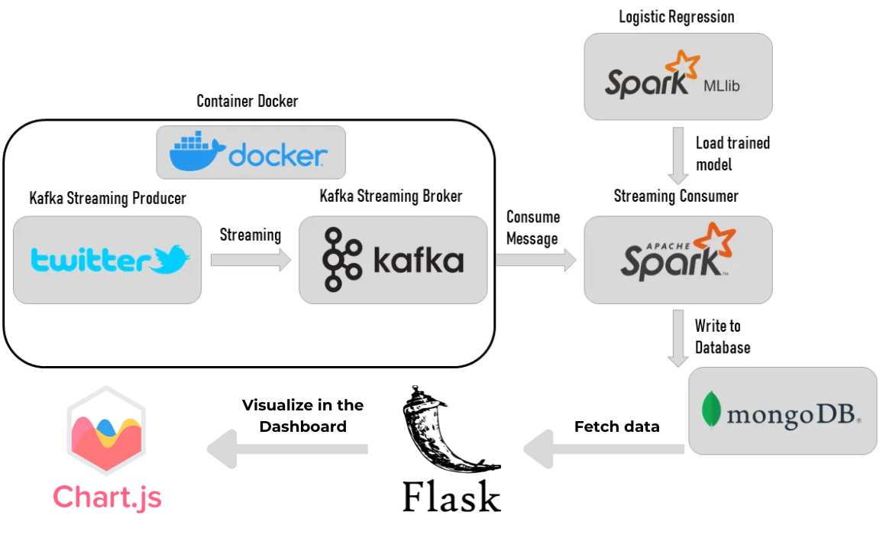
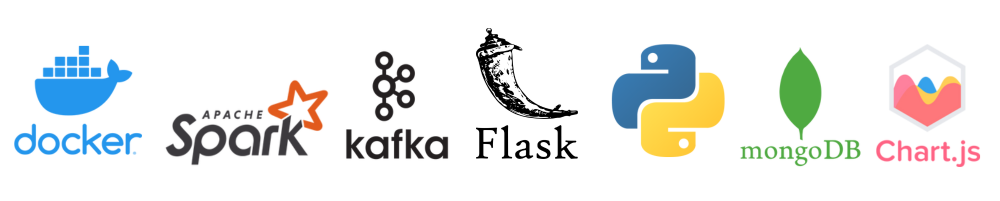
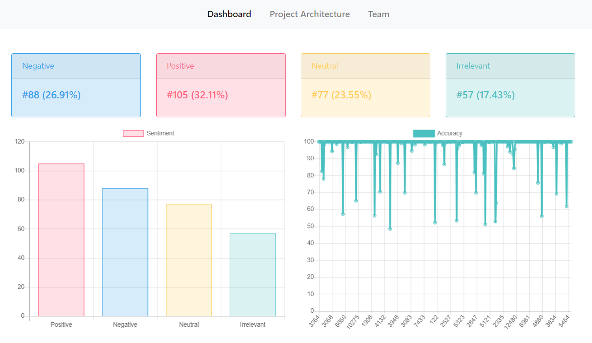
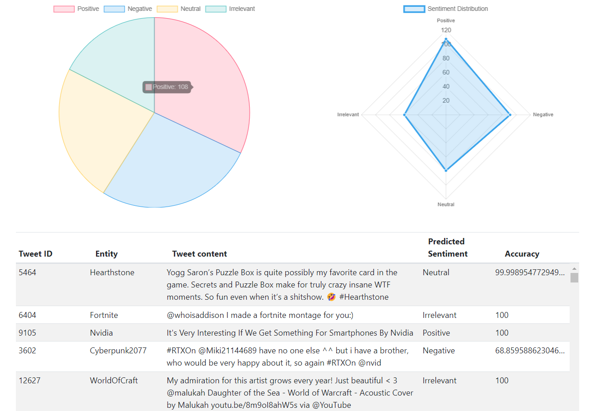

# Twitter Real-Time Sentiment Analysis

Ce projet a été réalisé dans le cadre du Mini Projet Big Data à l'Université Abdelmalek Essaadi, Faculté des Sciences et Techniques de Tanger, Département Génie Informatique. L'objectif principal était de développer une application Web permettant de prédire en temps réel les sentiments des tweets en utilisant l'API Apache Kafka Streams.

## Table des Matières
- [Aperçu](#aperçu)
- [Architecture](#architecture)
- [Structure du Projet](#structure-du-projet)
- [Technologies Utilisées](#technologies-utilisées)
- [Installation](#installation)
- [Utilisation](#utilisation)
- [Contributeurs](#contributeurs)

## Aperçu

Ce projet permet de :
- Récupérer les tweets en temps réel
- Analyser les sentiments des tweets
- Visualiser les résultats en temps réel sur un tableau de bord

## Architecture

L'architecture du projet est illustrée ci-dessous :



1. **Producteur de Streaming Kafka** :
   - Récupération des tweets via le fichier csv "twitter_validation.csv".
   - Envoi des tweets à Kafka pour le streaming.

2. **Courtier de Streaming Kafka** :
   - Distribution des tweets aux consommateurs.

3. **Consommateur de Streaming** :
   - Predicte des tweets en utilisant un modèle de Régression Logistique.
   - Envoi des résultats à MongoDB.

4. **Base de Données** :
   - Stockage des résultats dans MongoDB.

5. **Application Web** :
   - Déploiement avec Flask.
   - Visualisation des résultats en temps réel avec Chart.js.

## Structure du Projet

```bash
twitter-sentiment-analysis/
│
├── data_consumer/               # Contient les scripts pour consommer les données de Kafka
│   ├── lr_model/                # Contient le modèle de Régression Logistique entraîné
│   │   └── model.pkl            # Fichier du modèle entraîné
│   ├── kafka_consumer.py        # Script pour consommer les messages de Kafka
│   └── requirements.txt         # Dépendances nécessaires pour le consommateur de données
│
├── data_producer/               # Contient les scripts pour produire des données dans Kafka
│   ├── Dataset/                 # Contient les jeux de données d'entraînement et de validation
│   │   ├── twitter_training.csv # Jeu de données d'entraînement
│   │   └── twitter_validation.csv # Jeu de données de validation
│   ├── Dockerfile               # Dockerfile pour créer l'image du producteur de données
│   ├── kafka_producer.py        # Script pour produire des messages dans Kafka
│   └── requirements.txt         # Dépendances nécessaires pour le producteur de données
│
├── images/                      # Contient les images utilisées dans le projet
│   ├── architecture.png         # Diagramme de l'architecture du projet
│   └── technologies.png         # Diagramme des technologies utilisées
│
├── templates/                   # Contient les templates HTML pour l'application web
│   └── index.html               # Page principale de l'application web
│
├── Pysparktrait.ipynb           # Notebook Jupyter pour le prétraitement des données avec PySpark
├── README.md                    # Fichier README décrivant le projet
├── app.py                       # Script principal de l'application Flask
├── docker-compose.yml           # Fichier de configuration Docker Compose
```

## Technologies Utilisées



| Catégorie                | Outils/Technologies    | Description                                                                                         |
|--------------------------|------------------------|-----------------------------------------------------------------------------------------------------|
| **Technologies et Outils** | Kafka                   | Utilisé pour le streaming des données en temps réel.                                                 |
|                          | Spark                   | Utilisé pour le traitement et l'analyse des données.                                                 |
|                          | Docker                  | Utilisé pour la conteneurisation des services, assurant une portabilité et une gestion simplifiée.    |
|                          | MongoDB                 | Utilisé pour la persistance des résultats de l'analyse des sentiments.                               |
| **Langages de Programmation** | Python                  | Langage principal utilisé pour le développement de l'application.                                     |
|                          | JavaScript              | Utilisé pour le développement du frontend et la visualisation des données avec Chart.js.              |
| **Frameworks et Librairies** | Flask                   | Utilisé pour développer le backend de l'application web.                                             |
|                          | Chart.js                | Utilisé pour la visualisation des données en temps réel.                                             |
| **Librairies Python**    | kafka-python            | Utilisé pour interagir avec Apache Kafka depuis les scripts Python.                                   |
|                          | pymongo                 | Utilisé pour interagir avec MongoDB.                                                                  |
|                          | pyspark                 | Utilisé pour le traitement des données et l'entraînement des modèles de machine learning avec Spark.  |
|                          | pandas                  | Utilisé pour la manipulation et l'analyse des données.                                                |
|                          | flask                   | Utilisé pour développer le backend de l'application web.                                             |
| **Dépôt de Code**        | GitHub                  | Héberge le code source du projet, facilitant la collaboration et le suivi des modifications du code. |

## Installation

Pour installer et exécuter ce projet localement, suivez les étapes ci-dessous :

1. Clonez le dépôt :
   ```bash
   git clone https://github.com/amine-sabbahi/twitter-sentiment-analysis.git
   cd twitter-sentiment-analysis
   ```
2. Configurez les environnements Docker :
   ```bash
   docker-compose up --build
   ```
3. Start and connect to the MongoDB Service :
   ```bash
   sudo systemctl start mongodb
   mongo
   ```
4. Démarrez l'application Flask :
   ```
   python app.py
   ```
## Utilisation

1. Accédez à l'application Web à l'adresse suivante : http://localhost:5000.
2. Visualisez les sentiments des tweets en temps réel sur le tableau de bord.





## Contributeurs

   - [SABBAHI MOHAMED AMINE](https://github.com/amine-sabbahi).

   - [MAHRI AYMANE](https://github.com/AymaneM21).

---

**Université Abdelmalek Essaadi** Faculté des Sciences et Techniques de Tanger
   - Département : Génie Informatique
   - Master : AISD
   - Module : Big Data
   - Encadré par : Pr . EL YUSUFI YASYN
